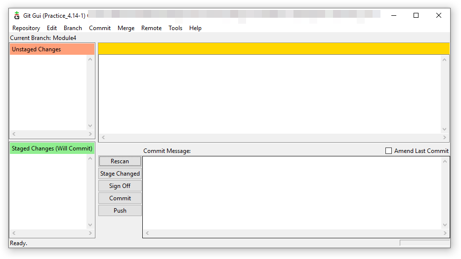
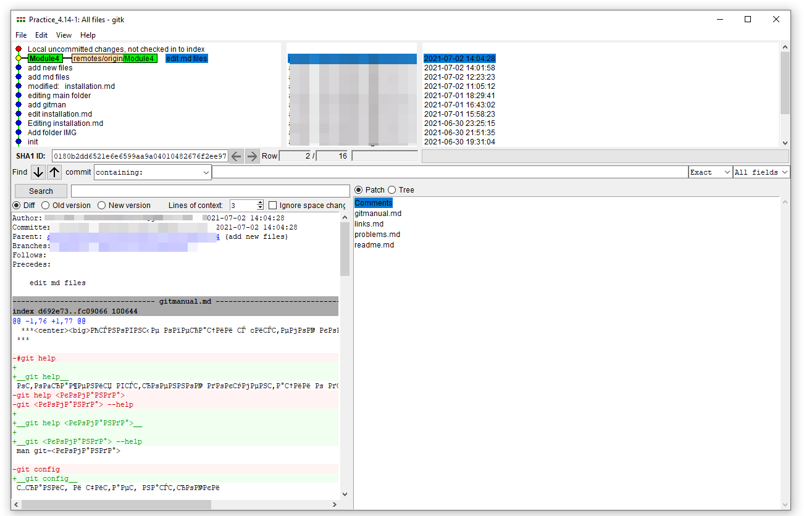

***
 ***
<big>Основные операции с cистемой контроля версий GIT</big>
***  
***

 ***
<big>Команды и их краткое описание</big>
***  

__
Настройка и конфигурация
__  

__git help__  
- служит для отображения встроенной документации о других командах.  

__git config__  
- хранит и читает настройки.  

__
Клонирование и создание репозиториев
__  

__git init__  
- необходима для создания репозитория, превращает обычный каталог в Git репозиторий.  

__git clone__  
-  используется для клонирования репозитория.  

__
Основные команды
__  

__git add__  
- добавляет содержимое рабочего каталога в индекс для последующего коммита.  

__git status__  
- показывает состояния файлов в рабочем каталоге и индексе: какие файлы изменены, но не добавлены в индекс; какие ожидают коммита в индексе.  

__git diff__  
- используется для вычисления разницы между любыми двумя Git деревьями.  

__git commit__  
- берёт все данные, добавленные в индекс с помощью git add, и сохраняет их слепок во внутренней базе данных, а затем сдвигает указатель текущей ветки на этот слепок.  

__git reset__  
- используется в основном для отмены изменений.  

__git rm__  
- используется для удаления файлов из индекса и рабочей копии.  

__git mv__  
- способ переместить файл.  

__git clean__  
- используется для удаления мусора из рабочего каталога.  

__
Ветвление и слияния
__  

__git branch__  
- команда умеет перечислять ветки, создавать новые, удалять и переименовывать их.  

__git checkout__  
- используется для переключения веток и выгрузки их содержимого в рабочий каталог.  

__git merge__  
- используется для слияния одной или нескольких веток в текущую.  

__git log__  
- используется для просмотра истории коммитов.  

__
Совместная работа и обновление проектов
__  

__git fetch__  
- связывается с удалённым репозиторием и забирает из него все изменения, которых у вас пока нет и сохраняет их локально.  

__git pull__  
- работает как комбинация команд git fetch и git merge, т. е. Git вначале забирает изменения из указанного удалённого репозитория, а затем пытается слить их с текущей веткой.  

__git push__  
 - используется для установления связи с удалённым репозиторием, вычисления локальных изменений отсутствующих в нём, и их передачи в вышеупомянутый репозиторий.  

__git remote__  
- служит для управления списком удалённых репозиториев.  

__
Осмотр и сравнение
__  

__git show__  
- отображает объект в простом виде, например для просмотра информации о метке или коммите.  

__
Администрирование
__  

__git fsck__  
- используется для проверки внутренней базы данных на предмет наличия ошибок и несоответствий. 

__git gui__  
- используется для редактирования отдельных коммитов:  
 

__gitk__  
- используется для просмотра истории:  
 

***
