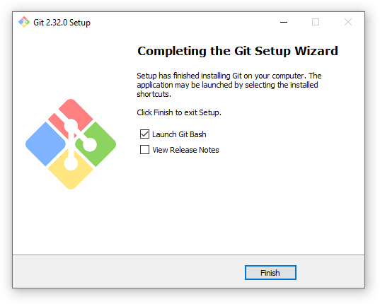

 ***
<big>ИНСТРУКЦИЯ ПО ИНСТАЛЛЯЦИИ GIT   
 НА ПЭВМ С ОПЕРАЦИОННОЙ СИСТЕМОЙ WINDOWS.</big> 
***
***
      1. Необходимо узнать тип операционной системы (ОС):     
1.1. откройте "Проводник" (нажмите на клавиатуре сочетание клавиш Win+E), далее кликните правой кнопкой мыши (далее по тексту - ПКМ) по иконке "Мой компьютер" (1) --> далее нажмите ПКМ "Свойства" (2):   
      

1.2. В октрывшемся окне найдите строку:
_"Тип системы: 64-разрядная операционная система"_(3):   
  

   2. Откройте браузер Интернета (например Google Chrome), зайдите на поисковый сайт, например: https://www.google.com/, в строке поиска введите _"GIT"_ (1), откройте ссылку: https://git-scm.com (2):
   

3. На сайте https://git-scm.com (4) перейдите в раздел _"Downloads"_ (5):   
   

4. Для скачивания нажмите на ссылку на слове _"Windows"_ (6), или сразу на ссылку _"Download 2.32.0 for Windows"_:
:   

5. Нажмите на ссылку _"64-Bit Git for Window Setup"_ (7):
:   

6. Перейдите в _"Проводник"_ в папку _"Downloads"_ или (Загрузки), найдите скачанный файл _"Git-2.32.0.-64-bit.exe"_ и запустите его:
:   

7. Нажмите _"Запустить"_:   
:   

8. Далее следуйте инструкции _"Next"_:   
:   

9. Выберете папку для установки, и нажмите _"Next"_:   
:   

10. Выберете название папки для ярлыка, и нажмите _"Next"_:   
:   

11. Выберете текстовый редактор который будет установлен по-умолчанию, и нажмите _"Next"_:   
:   

12. Выберете компоненты для установки, и нажмите _"Next"_:   
:   

13. Выберите среду PATH, и нажмите _"Next"_:   
:   

14. Выберете какую библиотеку SSL / TLS вы будете использовать для HTTPS, и нажмите _"Next"_:   
:   

15. Сохраните конвертацию конца строки по умолчанию, и нажмите _"Next"_:   
:   

16. Выберете эмулятор терминала, и нажмите _"Next"_:   
:   

17. Настройте дополнительные и эксперементальные параметры, опции, функции, и нажмите _"Next"_:   
:   
:   
:  
:  

18. Проверьте "_Launch Git Bash"_ и завершите настройку, выбрав _"Finish"_:   
:

Исталляция успешно завершена!
***

