 ***
<big>ИНСТРУКЦИЯ ПО УСТАНОВКЕ СИСТЕМЫ КОНТРОЛЯ ВЕРСИЙ (СКВ) GIT   
 НА ПЭВМ С ОПЕРАЦИОННОЙ СИСТЕМОЙ WINDOWS.</big>
***   
***
   
1. Необходимо узнать тип операционной системы (ОС):     
откройте _"Проводник"_ (нажмите на клавиатуре сочетание клавиш _"Win+E"_),   
далее кликните правой кнопкой мыши (ПКМ) по иконке _"Мой компьютер"_ (1)   
--> далее нажмите левой кнопкой мыши (ЛКМ) _"Свойства"_ (2):   

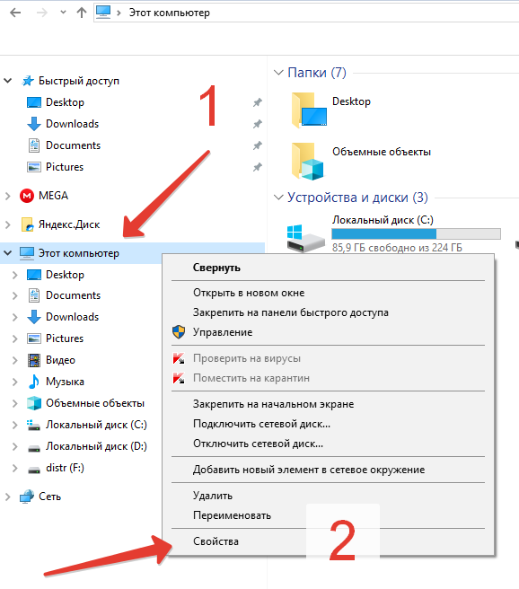  

2. В октрывшемся окне найдите строку:
_"Тип системы: 64-разрядная операционная система"_(3):   

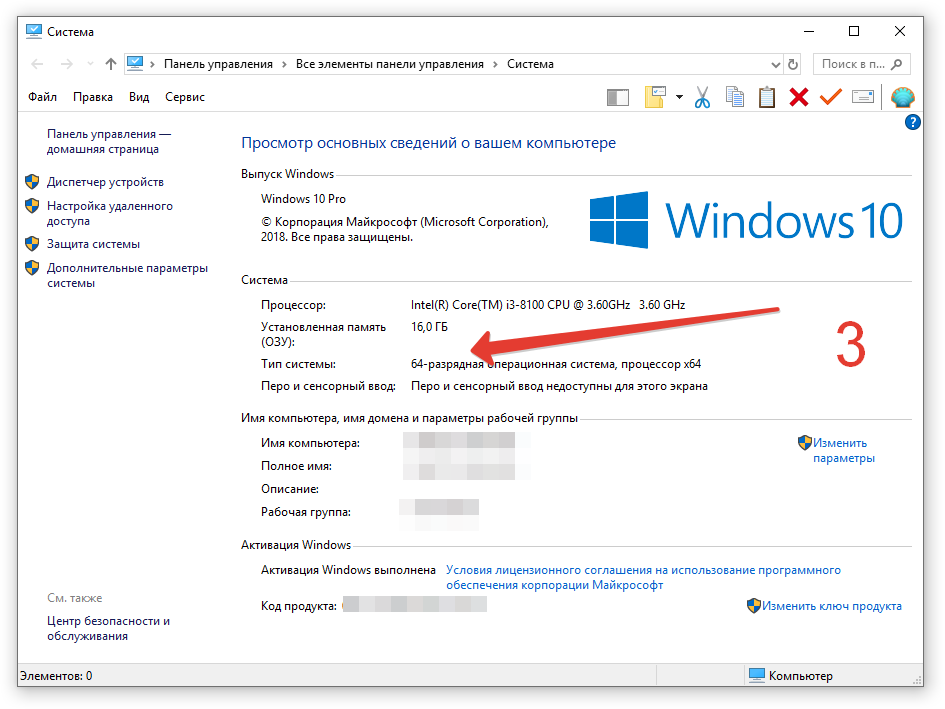   

3. Откройте браузер Интернета (например _"Google Chrome"_),   
зайдите на поисковый сайт, например: https://www.google.com,     
в строке поиска введите _"GIT"_ (1), откройте ссылку: https://git-scm.com (2):   

   

4. На сайте https://git-scm.com (4) перейдите в раздел _"Downloads"_ (5):   

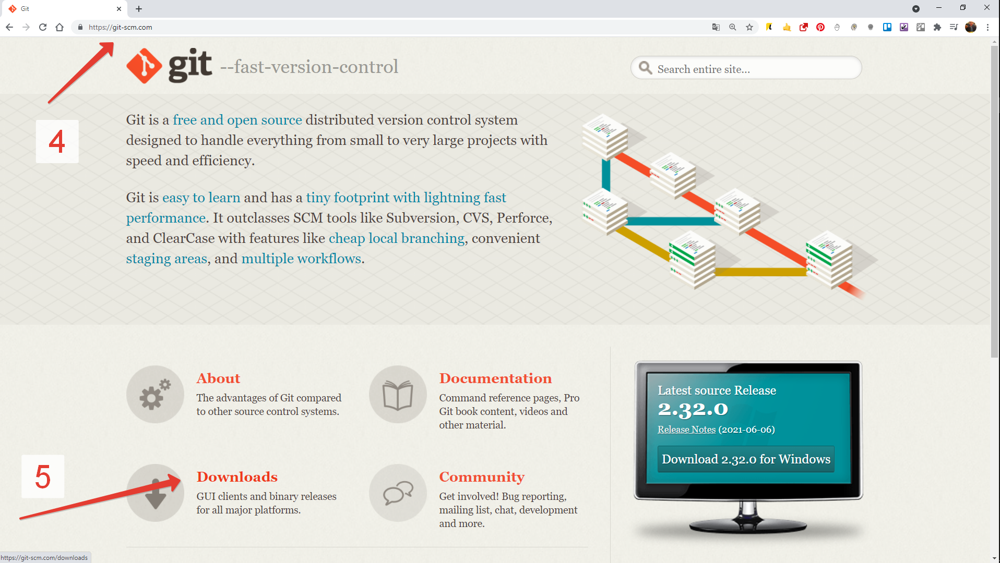   

5. Для скачивания нажмите на ссылку на слове _"Windows"_ (6),   
или сразу на ссылку _"Download 2.32.0 for Windows"_:   

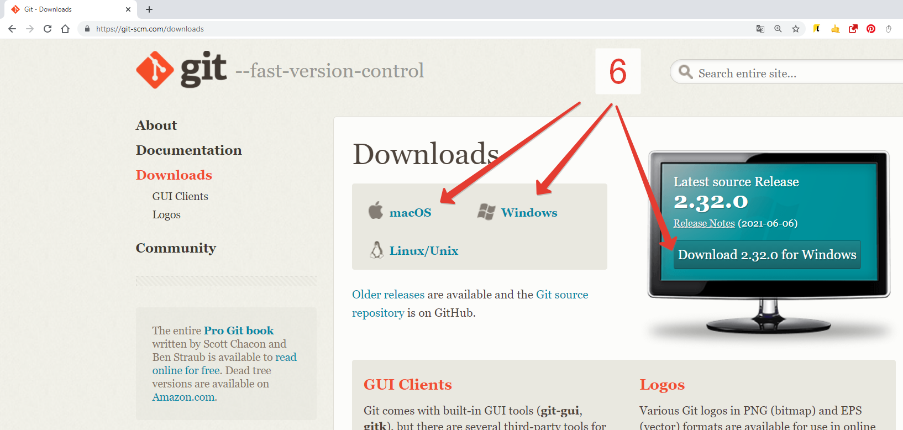   

6. Нажмите на ссылку _"64-Bit Git for Window Setup"_ (7):   

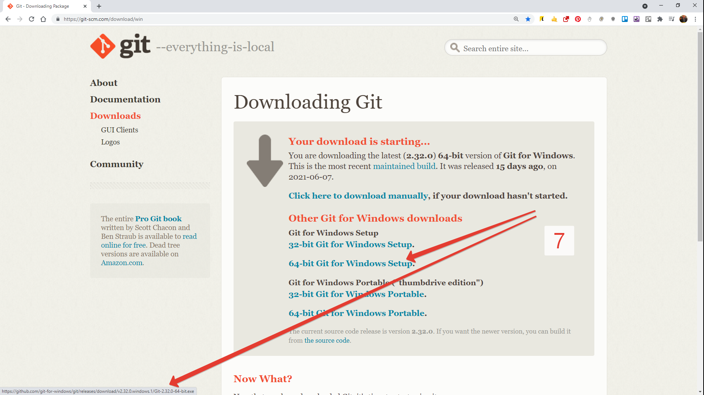   
 
и сохраните на локальный диск (8):

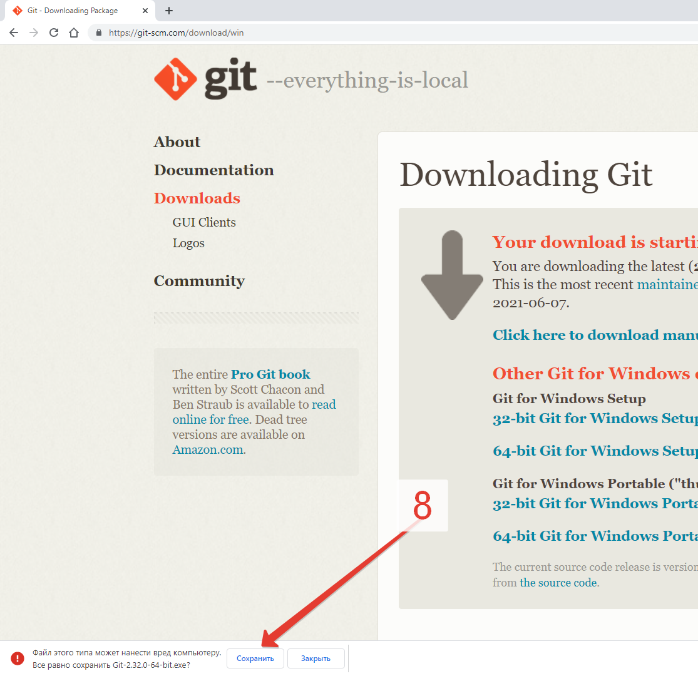   

7. Перейдите в _"Проводник"_, далее в папку _"Downloads"_ или (Загрузки),   
найдите скачанный файл _"Git-2.32.0.-64-bit.exe"_ и запустите его:   

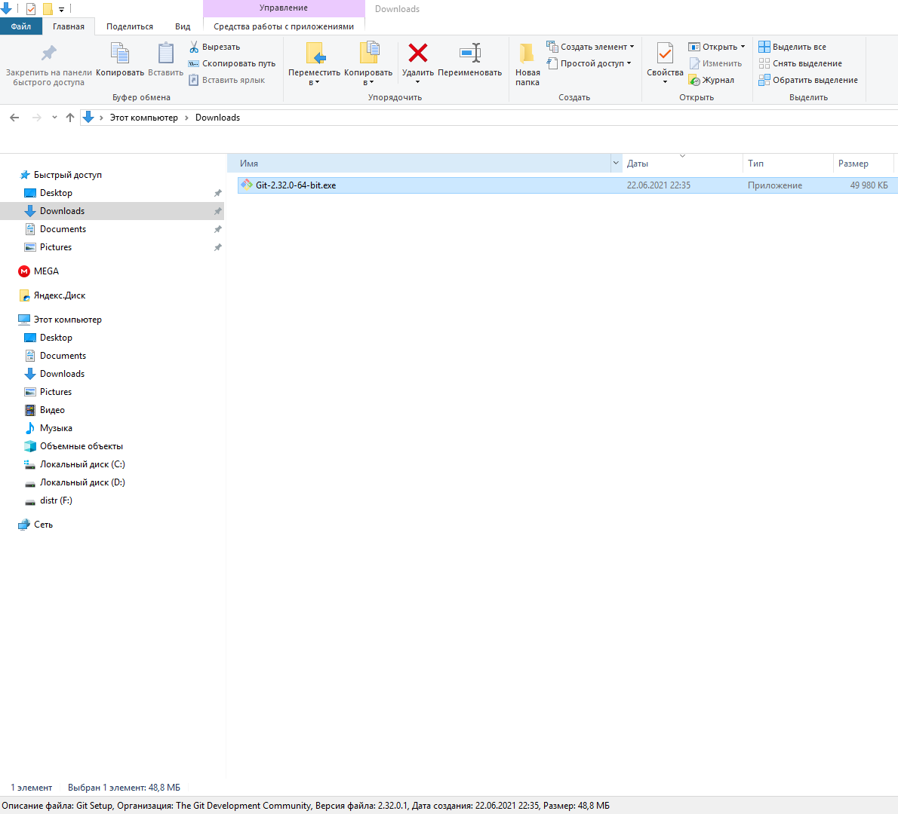   

8. Нажмите _"Запустить"_:   

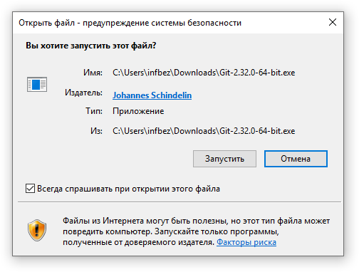   

9. Далее следуйте инструкции _"Next"_:   

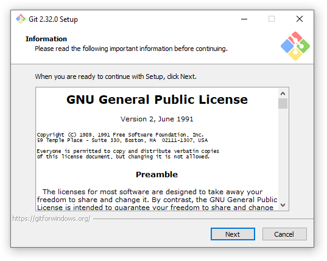   

10. Выберете папку для установки, и нажмите _"Next"_:   

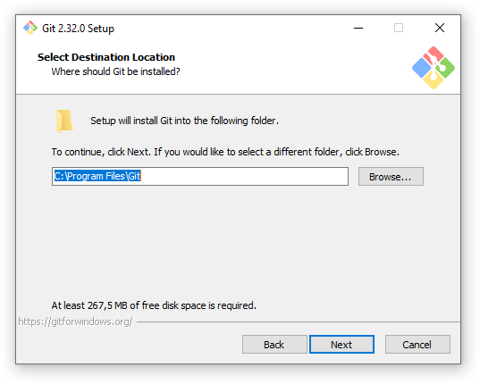   

11. Выберете название папки для ярлыка, и нажмите _"Next"_:   

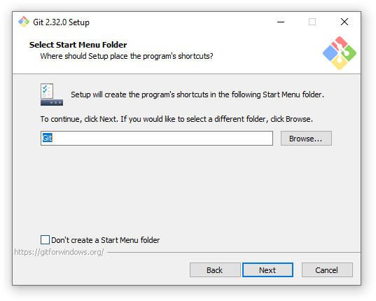   

12. Выберете текстовый редактор который будет установлен по-умолчанию, и нажмите _"Next"_:   

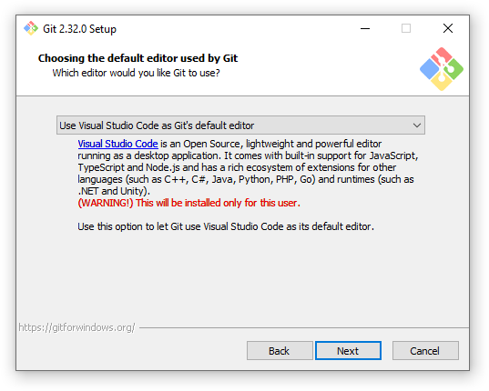   

13. Выберете компоненты для установки, и нажмите _"Next"_:   

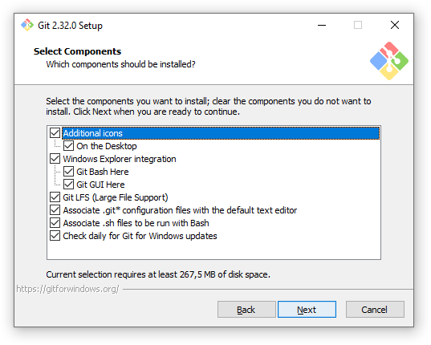   

14. Выберите среду способ использования из командной строки:   
(_"Use Git from Git Bash only"_ - использование только из командной строки Bash;   
_"Use Git from the Windows Command Prompt"_ - использование командной строки Bash,   
а также минимальный набор команд Git из консоли Windows;    
_"Use Git and optional Unix tools from the Windows Command Prompt"_   
- использование Git и утилит Unix из командной строки Windows,   
в этом случае будут перезаписаны некоторые утилиты Windows, например _"find"_ и _"sort"_),   
и нажмите _"Next"_:   

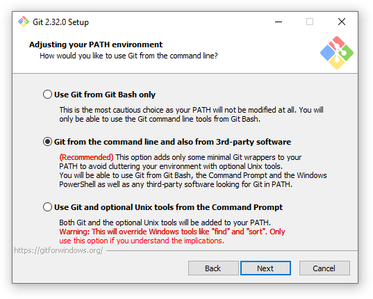   

15. Выберете какую библиотеку SSL / TLS вы будете использовать для HTTPS:   
(_"OpenSSL"_ - сертификаты сервера будут проверяться с использованием Unix-файла _"ca-bundle.crt"_.   
_"Windows Secure Channel"_ - сертификаты сервера будут проверяться с использованием стандартной библиотеки Windows),   
и нажмите _"Next"_:   

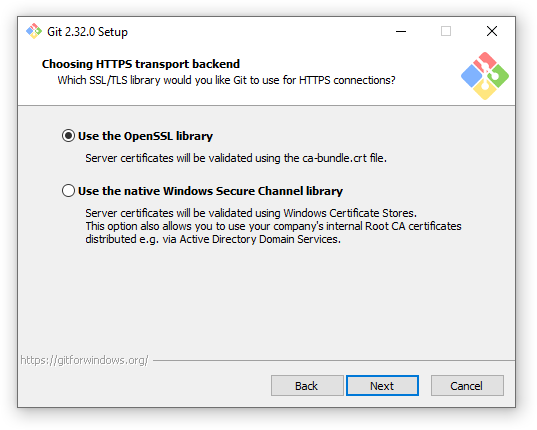   

16. Выберете способ обработки окончания строк:   
(_"«Checkout Windows-style, commit Unix-style line endings»"_   
- это значение гарантирует, что Git преобразует LF в CRLF при проверке текстовых файлов.   
При выполнении текстовых файлов CRLF также преобразуется в LF.   
Это мера совместимости для защиты новых строк в текстовых файлах,   
что позволяет легко работать с текстовыми файлами в Windows и на платформах Unix),   
и нажмите _"Next"_:   

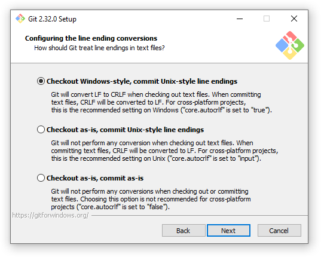   

17. Выберете эмулятор терминала:   
(_"MinTTY"_ - терминал Unix; _"Windows"_ - стандартный терминал Windows),   
и нажмите _"Next"_:   

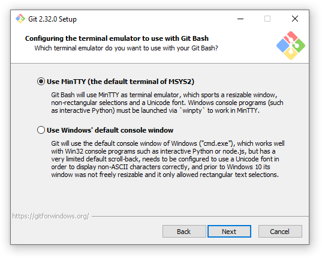   

18. Выберете способ внесения изменения по-умолчанию:   
простое смещение вперёд — иначе создание коммита слияния,   
преобразование или перебазирование и получение изменений,    
нажмите _"Next"_:   

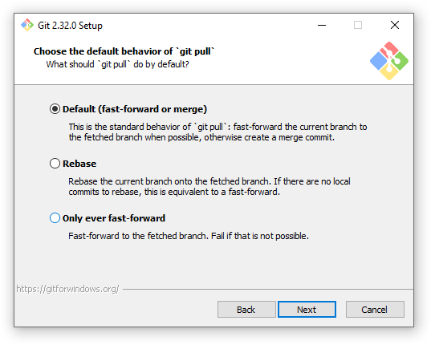   

19. Включите или отключте менеджер учетных данных
(_"Git Credential Manager"_), и нажмите _"Next"_:      

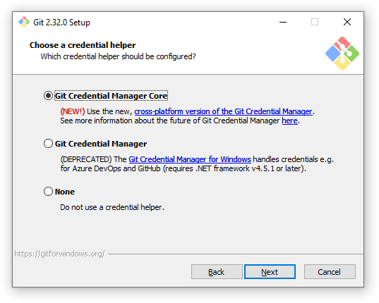   

20. Включите дополнительные опции и функции:
(_"File system caching"_ - кэширование файловой системы,   
_"Symbolic links"_ - разрешить символьные ссылки),   
и нажмите _"Next"_:   

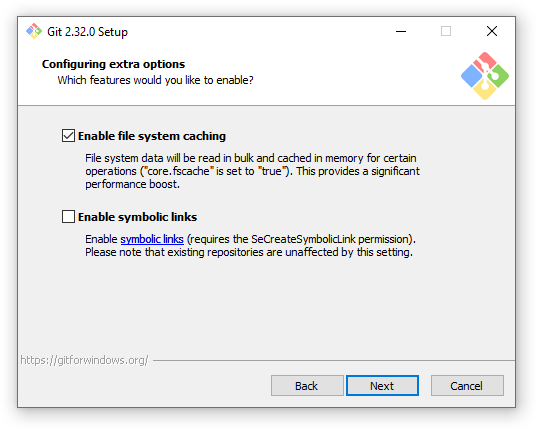  

21. Выберете эксперементальные опции, и нажмите _"Install"_:   

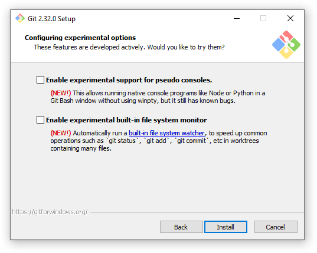   

22. Установить галочку запустить Git Bash ("_Launch Git Bash"_)   
и запустите процесс установки, нажав кнопку _"Finish"_:   

   

*Инсталляция программы СКВ GIT успешно завершена!*   
***
