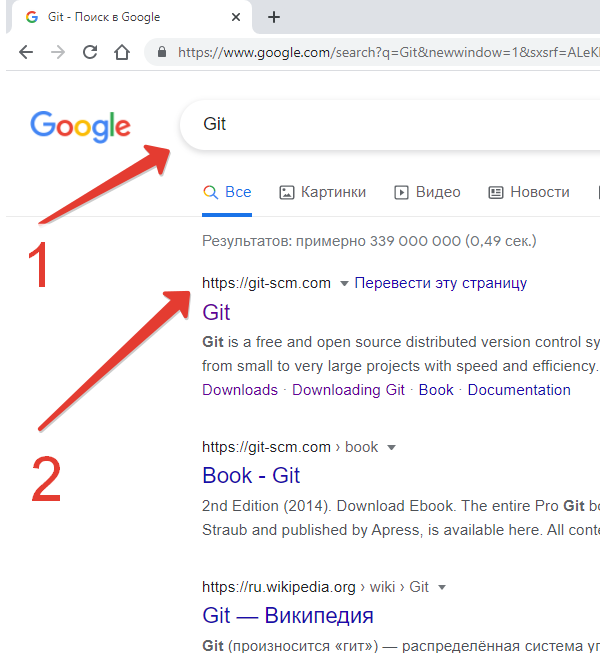

 ***
<big>ИНСТРУКЦИЯ ПО УСТАНОВКЕ СИСТЕМЫ КОНТРОЛЯ ВЕРСИЙ GIT   
 НА ПЭВМ С ОПЕРАЦИОННОЙ СИСТЕМОЙ WINDOWS.</big> 
***
***
   1. Необходимо узнать тип операционной системы (ОС):     
1.1. откройте _"Проводник"_ (нажмите на клавиатуре сочетание клавиш _"Win+E"_), далее кликните правой кнопкой мыши (далее по тексту - ПКМ) по иконке _"Мой компьютер"_ (1) --> далее нажмите ПКМ _"Свойства"_ (2):   
      

   1.2. В октрывшемся окне найдите строку:
_"Тип системы: 64-разрядная операционная система"_(3):   
   
2. Откройте браузер Интернета (например _"Google Chrome"_), зайдите на поисковый сайт, например: https://www.google.com/, в строке поиска введите _"GIT"_ (1), откройте ссылку: https://git-scm.com (2):   
   

   3. На сайте https://git-scm.com (4) перейдите в раздел _"Downloads"_ (5):   
   

   4. Для скачивания нажмите на ссылку на слове _"Windows"_ (6), или сразу на ссылку _"Download 2.32.0 for Windows"_:
   

   5. Нажмите на ссылку _"64-Bit Git for Window Setup"_ (7), сохраните на локальный диск (8):   
   
   

   6. Перейдите в _"Проводник"_ в папку _"Downloads"_ или (Загрузки), найдите скачанный файл _"Git-232.0.-64-bit.exe"_ и запустите его:
   

   7. Нажмите _"Запустить"_:   
      

   8. Далее следуйте инструкции _"Next"_:   
   

   9. Выберете папку для установки, и нажмите _"Next"_:   
   

   10. Выберете название папки для ярлыка, и нажмите _"Next"_:   
   

   11. Выберете текстовый редактор который будет установлен по-умолчанию, и нажмите _"Next"_:   
   

   12. Выберете компоненты для установки, и нажмите _"Next"_:   
   

   13. Выберите среду способ использования из командной строки: (_"Use Git from Git Bash only" использование только из командной строки Bash; _"Use Git from the Windows Command Prompt"_ - использование командной строки Bash, а также минимальный набор команд Git из консоли Windows; _"Use Git and optional Unix tools from the Windows Command Prompt"_ - использование Git и утилит Unix из командной строки Windows, в этом случае будут перезаписаны некоторые утилиты Windows, например _"find"_ и _"sort"_), и нажмите _"Next"_:   
   

   14. Выберете какую библиотеку SSL / TLS вы будете использовать для HTTPS (_"OpenSSL"_ - сертификаты сервера будут проверяться с использованием Unix-файла ca-bundle.crt.
_"Windows Secure Channel"_ - сертификаты сервера будут проверяться с использованием стандартной библиотеки Windows), и нажмите _"Next"_:   
   

   15. Выберете способ обработки окончания строк (_"«Checkout Windows-style, commit Unix-style line endings»"_ - это значение гарантирует, что Git преобразует LF в CRLF при проверке текстовых файлов. При выполнении текстовых файлов CRLF также преобразуется в LF. Это мера совместимости для защиты новых строк в текстовых файлах, что позволяет легко работать с текстовыми файлами в Windows и на платформах Unix), и нажмите _"Next"_:   
   

16. Выберете эмулятор терминала
(_"MinTTY"_ - терминал Unix; _"Windows"_ - стандартный терминал Windows), и нажмите _"Next"_:   
   

17. Выберете способ внесения изменения по-умолчанию:
простое смещение вперёд — иначе создание коммита слияния, преобразование или перебазирование и получение изменений, нажмите _"Next"_   

   

18. Настройте дополнительные и эксперементальные параметры, опции, функции (_"File system caching"_ - кэширование файловой системы, _"Git Credential Manager"_ - менеджер учетных данных, _"Symbolic links"_ - разрешить символьные ссылки), и нажмите _"Next"_:   

   

  

19. Выберете дополнительные и эксперементальные параметры, опции, функции, и нажмите _"Install"_:  

  

20. Проверьте "_Launch Git Bash"_ и завершите настройку, выбрав _"Finish"_:   
   

Инсталляция успешно завершена!   
***
