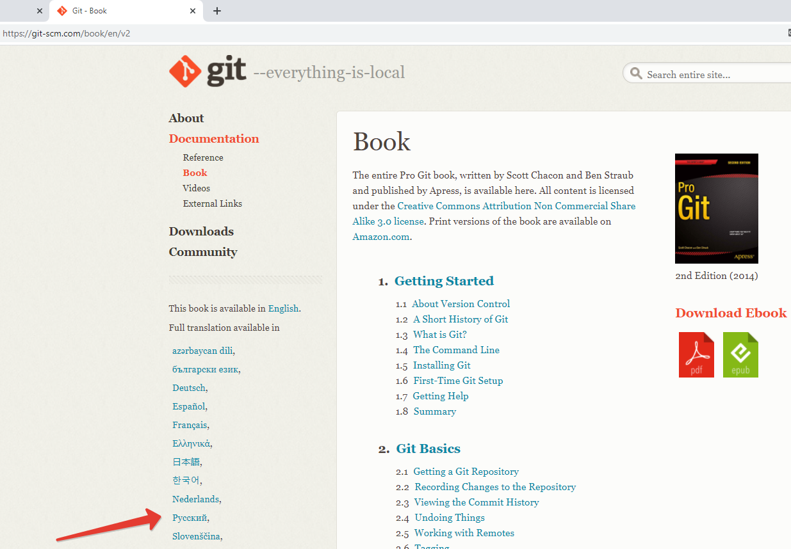
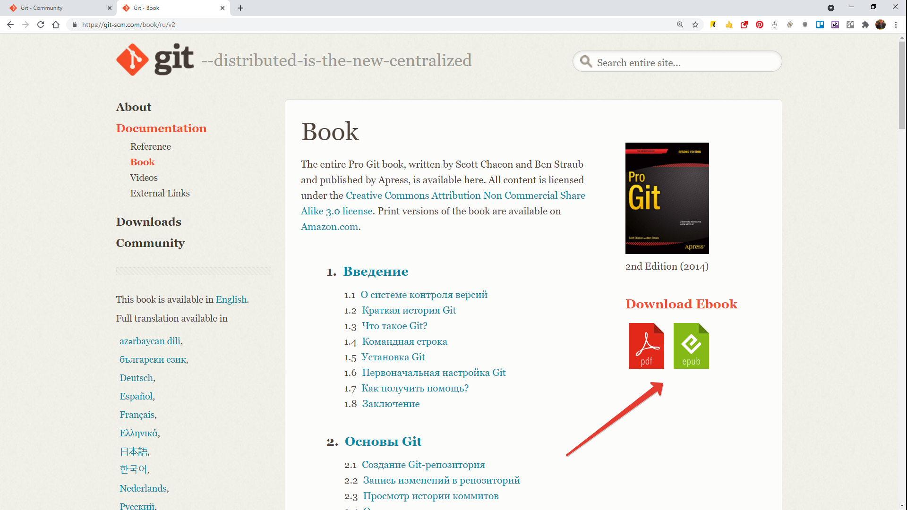
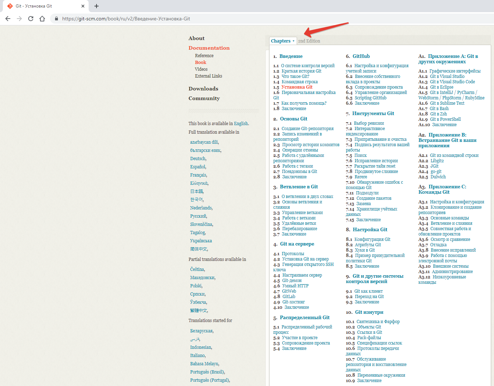

***  

<big>***Полезные ссылки при работе с GIT***
</big>  

***  
1. __"Pro Git"__ — На сайте  https://git-scm.com есть книга по работе с СКВ GIT (Scott Chacon, Ben Straub). Скачать которую можно перейдя в раздел "Dowmnloads":  
https://git-scm.com/downloads  

  

Есть вариант скачать книгу на русском языке:
  

На выбор есть 2 формата: _*pdf*_ и _*epub*_:
  

Разделы книги перечислены:  
  

2. __GitHub__ — Крупнейший веб-сервис для хостинга IT-проектов и их  совместной разработки (основан на системе контроля версий Git):  
https://github.com  

3. __Документация__  
https://docs.github.com

4. __Коммунити__  
https://github.community

5. __Git How To__ — Интерактивный тур по основами Git:  
https://githowto.com/ru/  

6. __Desktop Github__ — Программа предназначена «для упрощения необходимых шагов в рабочем потоке GitHub» и обеспечивает «единый интерфейс на обеих платформах»:  
https://desktop.github.com/
  

6. __gitignore__ — сервисы для генерации файла _*.gitignore*_ 
https://www.toptal.com/developers/gitignore
http://www.gitignore.io/

7. __Уроки по GIT__
https://monsterlessons.com/project/series/git-dlya-nachinayushih