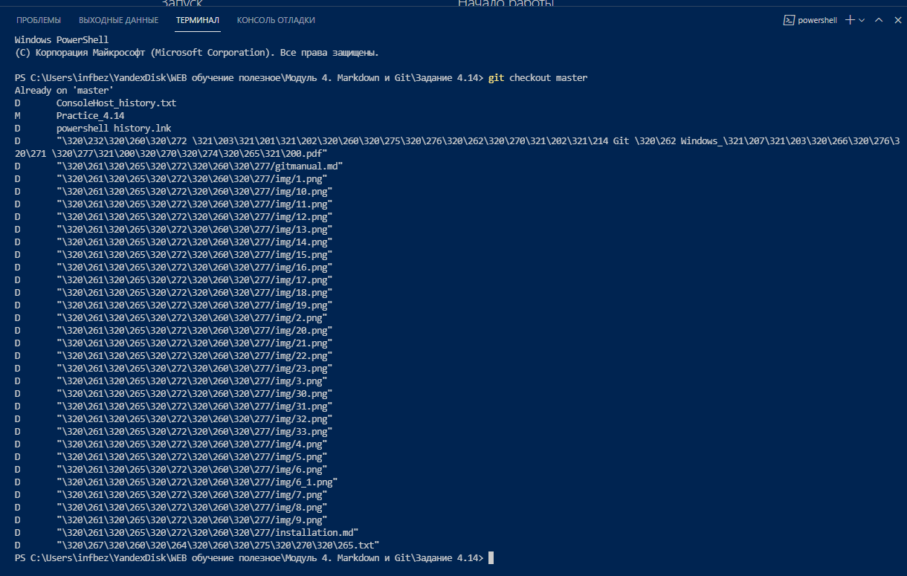
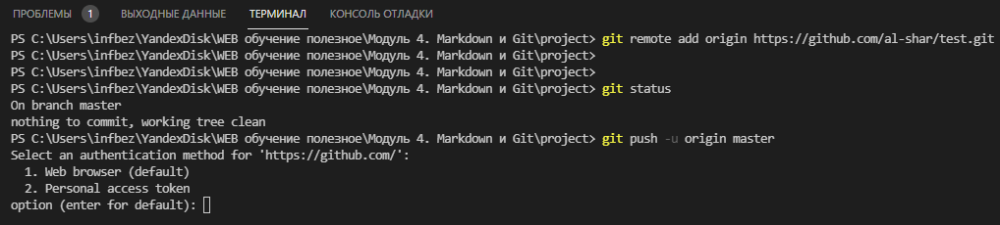
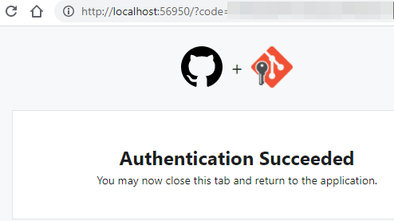
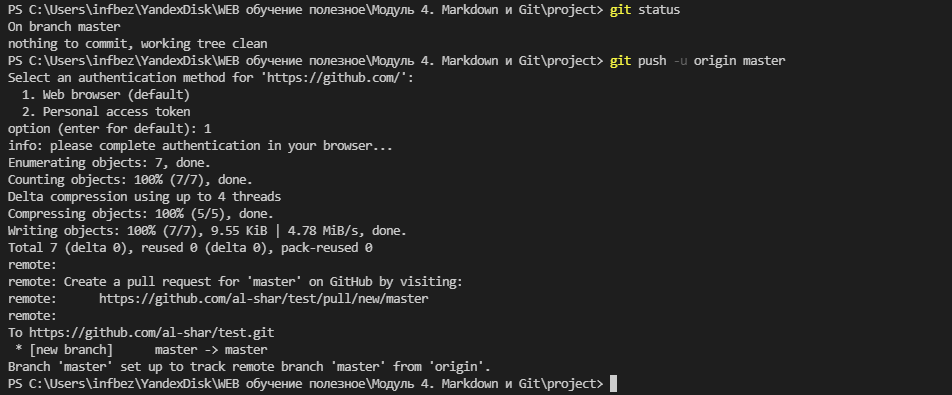
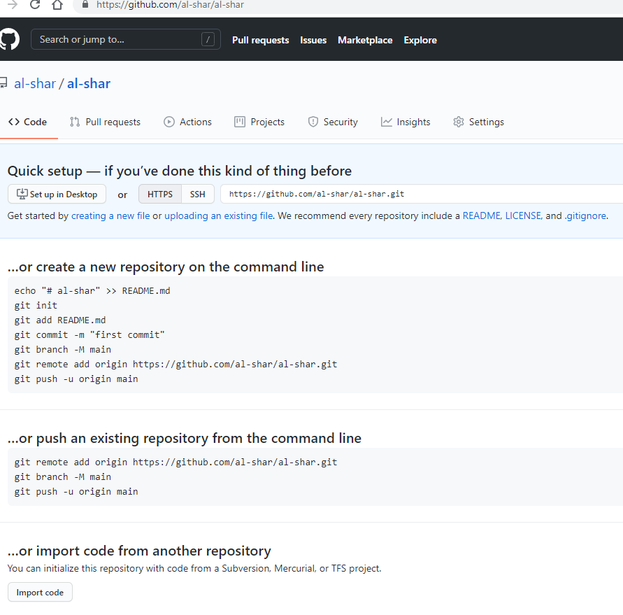

>_
 Omne initium difficile est!)
_ 
>_
 Всякое начало трудно!)
_  
***  

<big>Решение некоторых проблем при работе с СКВ GIT: ***
</big>  

***   

1. __Проблема:__ в программе VScode в окне терминала в ответ на команду вместо имен папок отражаются цифры:
  
__Решение__: Установка отображения unicode: по умолчанию, git будет печатать не-ASCII символов в именах файлов в виде восьмеричных последовательностей \nnn, что бы избежать нечитаемых строк, установите соответствующий флаг,    
Ввести команду:  
`"git config --global core.quotepath off"`  
  

2. __Проблема:__ Параметры установки окончаний строк.  
__Решение__:  
для пользователей Unix/Mac выполнить:  
`git config --global core.autocrlf input  
git config --global core.safecrlf warn  

Для пользователей Windowsвыполнить:  
git config --global core.autocrlf true  
git config --global core.safecrlf warn  

ВЫПОЛНИТЬ:
git config --global user.name "Your Name"
git config --global user.email "your_email@whatever.com"

3. __Проблема:__ Установка имени и электронной почты.  
__Решение:__  
git config --global user.name "Your Name"
git config --global user.email "your_email@whatever.com"

4. __Проблема:__ при первой загружке данных на сервер появляется запрос авторизации:  
__Решение:__  
  
Решение: В октрывшемся коне браузера разрешить авторизацию, _*Authorize*_:  
  
Откроется новое окно с ответом об успешной аутентификации:  
  
Можно закрыть окно и перейт и в основное окно программы:  
  

5. __Проблема:__ С чего начать работу с репозиторием?  
__Решение:__  
Вот что предлагает сделать на первых шагах сайт github:   
  

***