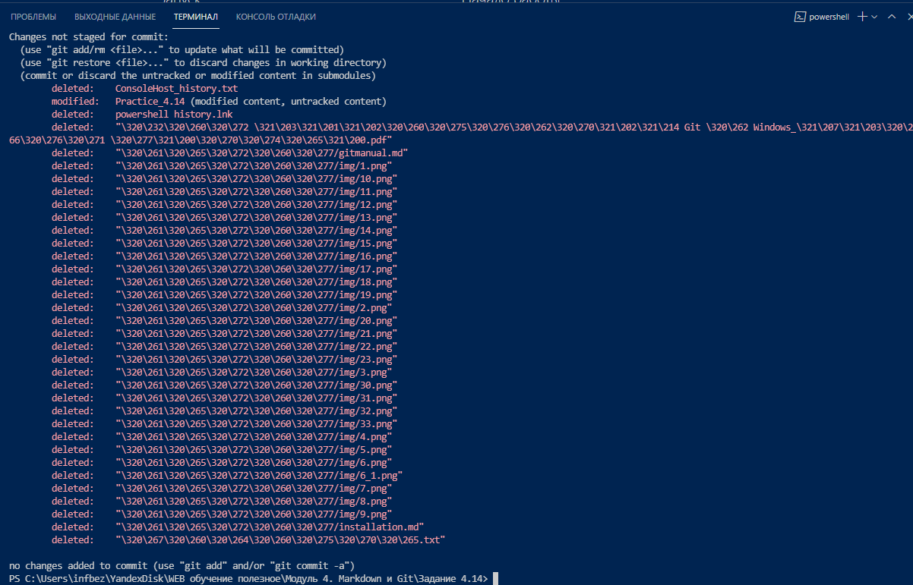

>_
 Omne initium difficile est!
_ 
>_
(Всякое начало трудно!)
_  
***  

<big>Решение некоторых проблем при работе с СКВ GIT: ***
</big>  

***   

1. __Проблема:__ в программе VScode в окне терминала в ответ на команду вместо имен папок отражаются цифры:
  
__Решение__: Установка отображения unicode: по умолчанию, git будет печатать не-ASCII символов в именах файлов в виде восьмеричных последовательностей \nnn, что бы избежать нечитаемых строк, установите соответствующий флаг,    
Ввести команду:  
`git config --global core.quotepath off`  
  

2. __Проблема:__ Параметры установки окончаний строк.  
__Решение__:  
для пользователей Unix/Mac выполнить:  
`git config --global core.autocrlf input`  
`git config --global core.safecrlf warn`  

Для пользователей Windowsвыполнить:  
`git config --global core.autocrlf true`  
`git config --global core.safecrlf warn`  

ВЫПОЛНИТЬ:
`git config --global user.name "Your Name"`  
`git config --global user.email "your_email@whatever.com"`  

3. __Проблема:__ Установка имени и электронной почты.  
__Решение:__  
`git config --global user.name "Your Name"`  
`git config --global user.email "your_email@whatever.com"`  

4. __Проблема:__ при первой загружке данных на сервер появляется запрос авторизации:  
__Решение:__  
  
Решение: В октрывшемся коне браузера разрешить авторизацию, _*Authorize*_:  
  
Откроется новое окно с ответом об успешной аутентификации:  
  
Можно закрыть окно и перейт и в основное окно программы:  
  

5. __Проблема:__ С чего начать работу с репозиторием?  
__Решение:__
Популярные команды для начала работы:
`git init`  
`git add`  
`git commit -m "Init"`  
`git remote add origin https://github.com/пользователь/репозиторий.git`  
`git push -u origin master`  

или от что предлагает сделать на первых шагах сайт github:   
  

6. __Проблема:__ Использование "горячих клавиш" при работе в VSCode:  
__Решение:__  

 

__"Ctrl + Shift + P"__ — вызов палитры команд __"Command Palette"__.  
  

__"Ctrl + P"__ — открытие командной строки без флагов.  
Чтобы открыть несколько файлов на редактирование, нажимаем Ctrl + P, “block”, стрелка вправо, (стрелка вниз + стрелка вправо) x2 — получаем 3 файла, открытые на редактирование.  

__"Ctrl + `"__ — открывает терминальное окно.  

__"Ctrl + B"__ — переключение видимости панели управления.  

__"Ctrl + ,"__ —переход в окно настроек.  

__"F11"__ — полноэкранный режим.  

***